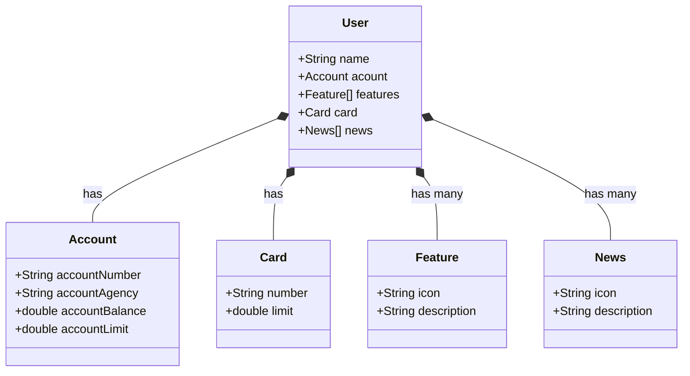

## Diagrama de Classes

```mermaid
classDiagram
    class User {
        +String name
        +Account acount
        +Feature[] features
        +Card card
        +News[] news
    }

    class Account {
        +String accountNumber
        +String accountAgency
        +double accountBalance
        +double accountLimit
    }

    class Feature {
        +String icon
        +String description
    }

    class Card {
        +String number
        +double limit
    }

    class News {
        +String icon
        +String description
    }

    User *-- Account : has
    User *-- Card : has
    User *-- Feature : has many
    User *-- News : has many
```
